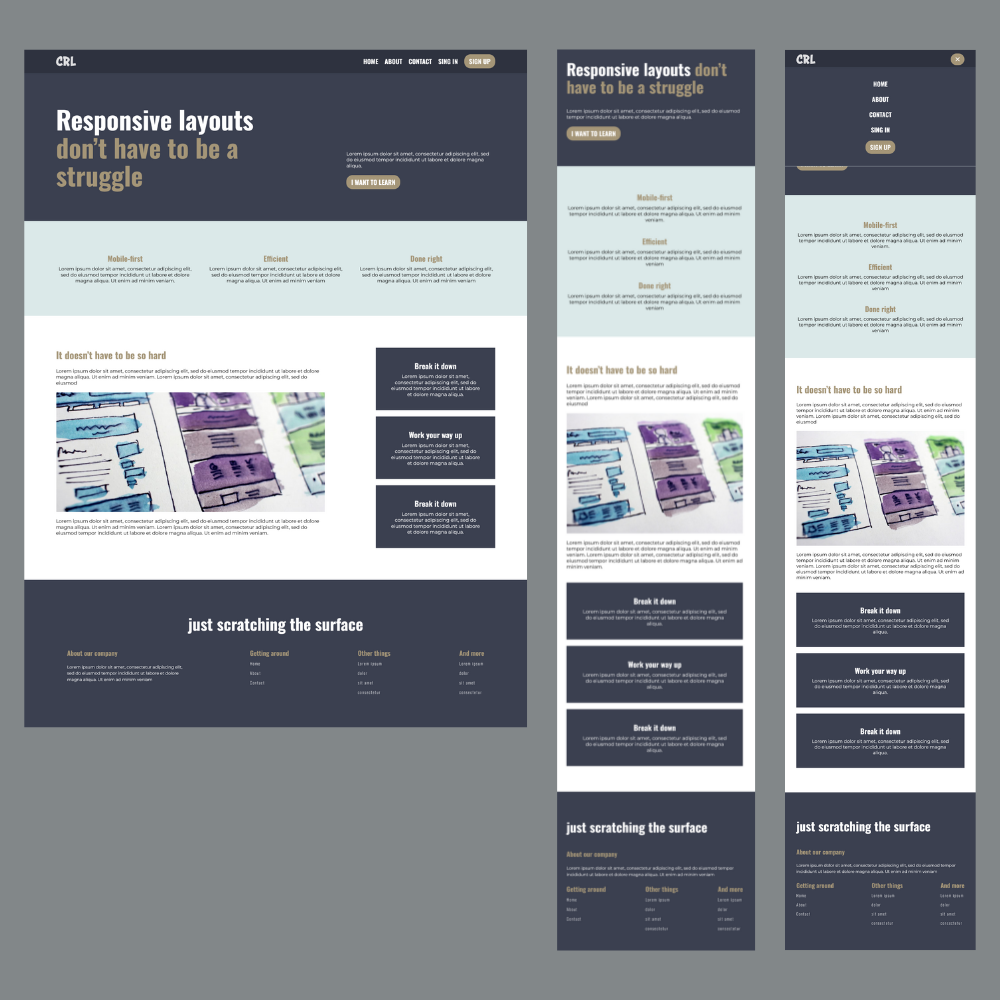

# Responsive Layout Project

## Table of Contents

1. [Overview](#overview)
2. [Screenshots](#screenshots)
3. [Features](#features)
4. [Technologies Used](#technologies-used)
5. [Live Demo](#live-demo)
6. [Installation](#installation)
7. [Usage](#usage)
8. [Contribution](#contribution)
9. [Acknowledgments](#acknowledgments)

## Overview

This project is the final challenge from Kevin Powell's course, [Conquering Responsive Layout](https://courses.kevinpowell.co/conquering-responsive-layouts). It demonstrates the creation of a fully responsive website layout using **Flexbox** and includes a dynamic navbar that adapts based on screen size.

## Screenshots

Here are some screenshots of the project:



## Features

- **Responsive Design**: The layout adjusts seamlessly across various screen sizes.
- **Flexbox**: Utilizes Flexbox for efficient and flexible layouts.
- **Dynamic Navbar**: Navbar changes based on screen size for an optimal user experience.
- **Clean and Modern Aesthetics**: Designed with a focus on usability and visual appeal.

## Technologies Used

- HTML
- CSS (Flexbox)
- JavaScript

## Live Demo

You can view the live site [here](#).

## Installation

To run this project locally, follow these steps:

1. Clone the repository:

   ```bash
   git clone https://github.com/asimsaeed353/conquering-responsive-layout-last-challenge.git
   ```

2. Navigate to the project directory:

   ```bash
   cd conquering-responsive-layout-last-challenge
   ```

3. Open the `index.html` file in your web browser.

## Usage

- Resize the browser window to see how the layout adapts.
- Click on the navbar items to test the functionality.

## Contribution

Feel free to fork the repository and make your own improvements! If you have suggestions or feedback, please open an issue.

## Acknowledgments

Special thanks to [Kevin Powell](https://www.kevinpowell.co/) for the course that inspired this project!
